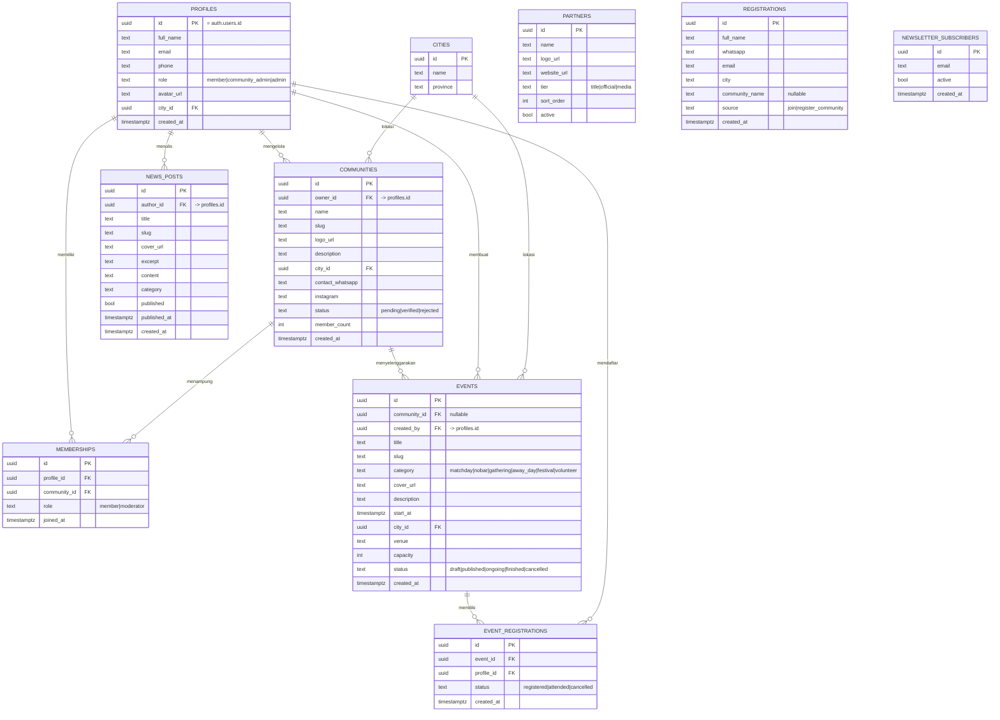

# Entity Relationship Diagram (ERD)
## Garuda Community Hub — Database Design (Supabase / PostgreSQL)

**Versi:** 1.0 · **Tanggal:** 8 Juni 2026

Dokumen ini mendeskripsikan model data untuk Garuda Community Hub. Dirancang untuk Supabase (PostgreSQL) dengan dukungan Auth bawaan (`auth.users`) dan Row Level Security (RLS).

---

## 1. Diagram ER



---

## 2. Penjelasan Entitas

| Tabel | Fungsi |
|---|---|
| `profiles` | Profil pengguna, terhubung 1:1 dengan `auth.users` Supabase. Menyimpan `role`. |
| `cities` | Master data kota/provinsi untuk filter direktori & event. |
| `communities` | Data komunitas, dimiliki seorang `community_admin`, butuh verifikasi admin. |
| `memberships` | Relasi many-to-many antara member dan komunitas. |
| `events` | Event yang dibuat komunitas/admin (matchday, nobar, dll.). |
| `event_registrations` | RSVP/pendaftaran member ke event. |
| `news_posts` | Artikel berita & cerita komunitas (CMS sederhana). |
| `partners` | Mitra/sponsor yang tampil di landing. |
| `registrations` | **Form publik landing (Fase 1)** — tangkapan lead sebelum sistem auth aktif. |
| `newsletter_subscribers` | Email pelanggan newsletter dari footer. |

> Catatan: `registrations` & `newsletter_subscribers` adalah tabel "lead capture" yang dipakai landing page Fase 1 tanpa autentikasi.

---

## 3. Skema SQL Supabase (siap dijalankan)

```sql
-- ENUMS
create type user_role as enum ('member', 'community_admin', 'admin');
create type community_status as enum ('pending', 'verified', 'rejected');
create type event_category as enum ('matchday','nobar','gathering','away_day','festival','volunteer');
create type event_status as enum ('draft','published','ongoing','finished','cancelled');

-- CITIES
create table cities (
  id uuid primary key default gen_random_uuid(),
  name text not null,
  province text,
  created_at timestamptz default now()
);

-- PROFILES (1:1 dengan auth.users)
create table profiles (
  id uuid primary key references auth.users(id) on delete cascade,
  full_name text,
  email text,
  phone text,
  role user_role not null default 'member',
  avatar_url text,
  city_id uuid references cities(id),
  created_at timestamptz default now()
);

-- COMMUNITIES
create table communities (
  id uuid primary key default gen_random_uuid(),
  owner_id uuid references profiles(id) on delete set null,
  name text not null,
  slug text unique not null,
  logo_url text,
  description text,
  city_id uuid references cities(id),
  contact_whatsapp text,
  instagram text,
  status community_status not null default 'pending',
  member_count int default 0,
  created_at timestamptz default now()
);

-- MEMBERSHIPS
create table memberships (
  id uuid primary key default gen_random_uuid(),
  profile_id uuid references profiles(id) on delete cascade,
  community_id uuid references communities(id) on delete cascade,
  role text default 'member',
  joined_at timestamptz default now(),
  unique (profile_id, community_id)
);

-- EVENTS
create table events (
  id uuid primary key default gen_random_uuid(),
  community_id uuid references communities(id) on delete set null,
  created_by uuid references profiles(id) on delete set null,
  title text not null,
  slug text unique not null,
  category event_category not null,
  cover_url text,
  description text,
  start_at timestamptz,
  city_id uuid references cities(id),
  venue text,
  capacity int,
  status event_status not null default 'draft',
  created_at timestamptz default now()
);

-- EVENT REGISTRATIONS
create table event_registrations (
  id uuid primary key default gen_random_uuid(),
  event_id uuid references events(id) on delete cascade,
  profile_id uuid references profiles(id) on delete cascade,
  status text default 'registered',
  created_at timestamptz default now(),
  unique (event_id, profile_id)
);

-- NEWS POSTS
create table news_posts (
  id uuid primary key default gen_random_uuid(),
  author_id uuid references profiles(id) on delete set null,
  title text not null,
  slug text unique not null,
  cover_url text,
  excerpt text,
  content text,
  category text,
  published bool default false,
  published_at timestamptz,
  created_at timestamptz default now()
);

-- PARTNERS
create table partners (
  id uuid primary key default gen_random_uuid(),
  name text not null,
  logo_url text,
  website_url text,
  tier text default 'official',
  sort_order int default 0,
  active bool default true
);

-- LEAD CAPTURE: REGISTRATIONS (form publik landing)
create table registrations (
  id uuid primary key default gen_random_uuid(),
  full_name text not null,
  whatsapp text not null,
  email text not null,
  city text,
  community_name text,
  source text default 'join',
  created_at timestamptz default now()
);

-- NEWSLETTER
create table newsletter_subscribers (
  id uuid primary key default gen_random_uuid(),
  email text unique not null,
  active bool default true,
  created_at timestamptz default now()
);

-- INDEXES
create index idx_communities_city on communities(city_id);
create index idx_communities_status on communities(status);
create index idx_events_category on events(category);
create index idx_events_start_at on events(start_at);
create index idx_events_status on events(status);
```

---

## 4. Contoh Row Level Security (RLS)

```sql
-- Aktifkan RLS
alter table registrations enable row level security;
alter table newsletter_subscribers enable row level security;
alter table communities enable row level security;

-- Form publik: siapa pun boleh INSERT lead (anonim)
create policy "anyone can submit registration"
  on registrations for insert
  to anon, authenticated
  with check (true);

create policy "anyone can subscribe newsletter"
  on newsletter_subscribers for insert
  to anon, authenticated
  with check (true);

-- Direktori publik: hanya komunitas terverifikasi yang bisa dibaca publik
create policy "public can read verified communities"
  on communities for select
  to anon, authenticated
  using (status = 'verified');

-- Pemilik komunitas bisa kelola komunitasnya
create policy "owner can manage own community"
  on communities for all
  to authenticated
  using (owner_id = auth.uid())
  with check (owner_id = auth.uid());
```

---

## 5. Catatan Implementasi
- Gunakan **Supabase Storage** bucket terpisah untuk `logos`, `event-covers`, `news-covers`.
- `slug` di-generate dari `name`/`title` (kebab-case) untuk URL yang ramah SEO.
- `member_count` bisa di-maintain via trigger saat insert/delete `memberships`.
- Untuk Fase 1 (landing), cukup aktifkan tabel `registrations`, `newsletter_subscribers`, `partners`, `events`, `news_posts`, `communities` (read-only seed) — sisanya menyusul di Fase 2–3.
